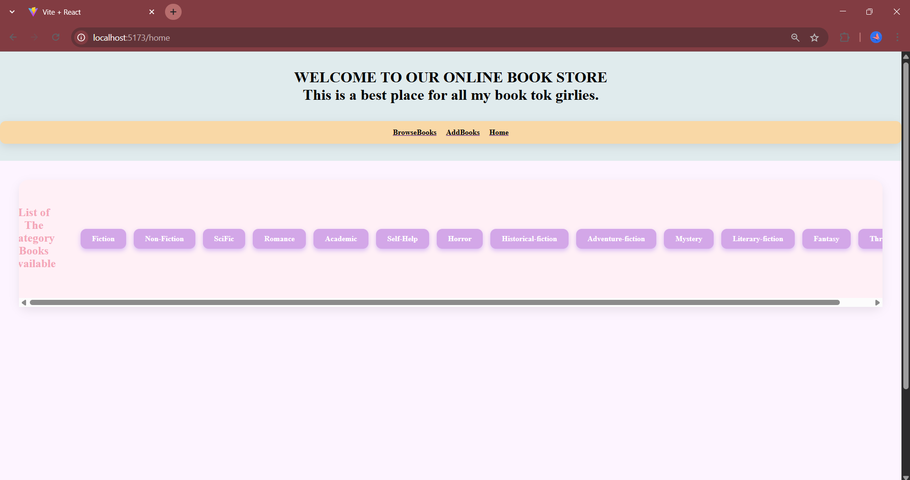

# Online Library System

A simple and stylish Online Library app built using **React + Vite**! ✨  
Used to manage books present in a particular place.

---

## ⚙️ Features

- Displays list of popular books
- Filters books by category
- Shows book details when clicked
- Search books by title or author name
- Add a new book using a form
- Form validation
- 404 error page

---

## 🚀 Getting Started

Follow these steps to set up the project locally:

### 1. Clone the repository

git clone https://github.com/anjali91106/Online_Library_System.git
cd Online_Library_System

### 2. Install dependencies

npm install
npm install react-router-dom
npm install @reduxjs/toolkit react-redux

### 3. Start the development server
npm run dev

## 📸 Screenshots

### 🧰 Tech Stack
Frontend: React, CSS

Framework: Bootstrap

State Management: Redux Toolkit

### 🙋‍♀️ Author

GitHub: @anjali91106
Email: anjalisoni86904@gmail.com
